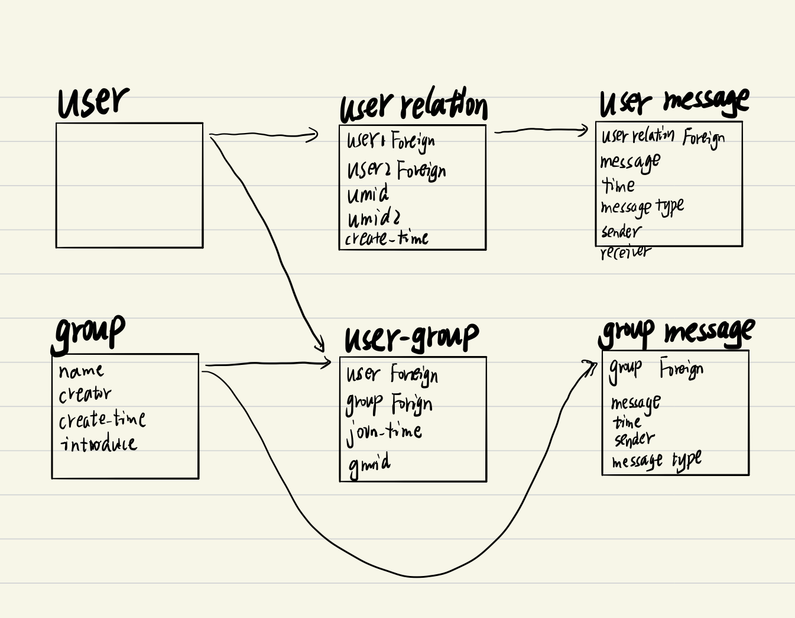
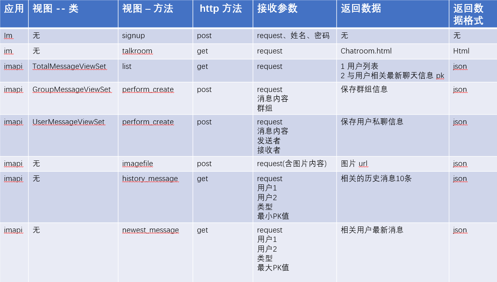
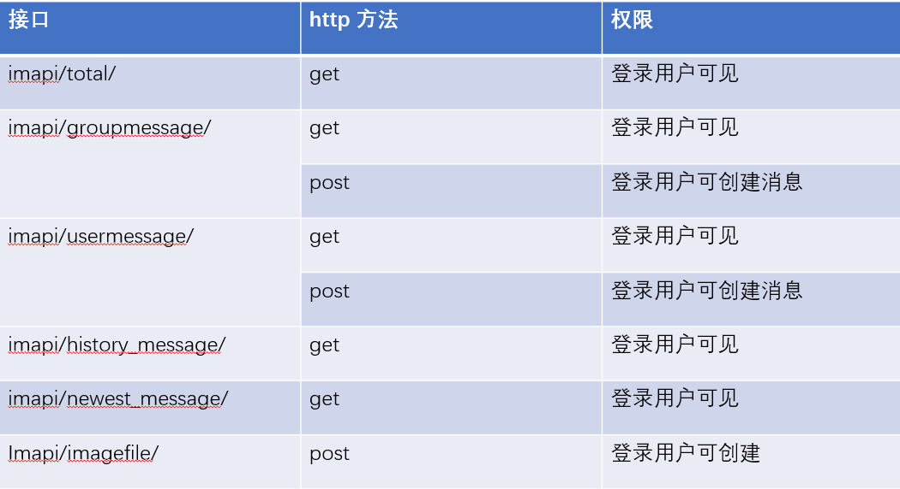

# Python 实现简单即时通讯
* 本项目介绍 Django 利用 Http 短连接轮询实现简单的本地局域网即时通讯。
## 当前功能状态
1. 用户登入，默认加入群组且只有一个群组
2. 显示所有在线用户且任意用户之间可私聊
3. 用户登录后默认显示与之相关的用户或群组之间的最新10条消息
4. 文字、图片信息发送
5. 查看历史消息
6. 消息提醒，暂以每次登录接收消息为新消息提醒的基准线
## 模型设计
* 用户模型使用 Django 自带的模型，模型按照多用户多群组设计（目前阶段部分代码按照一个群组，多用户编写；如获取群组消息时，直接获取群组消息模型中的数据，而未根据群组名进行筛选）。

      # 未使用 filter 及群名筛选
      GroupMessage.objects.all()
 
## 接口介绍
* 这里介绍主要的接口，主要是相关函数的作用。
 
* 接口权限，已 url 形式展示。
 
## 运行环境
* python 3.7
* windows/linux
## 运行依赖
* Django >= 2.6
* mysqlclient
* django rest framework
* pillow
## 文件说明
### 以下为详解部分
* 最外层的 SampleIm 文件夹只是包含你的项目文件，这个目录名与 Django 没有关联，可以任意命名。
* manage.py: 管理 Django 项目的命令行工具。 
* 里面一层的 SampleIm 包含你的项目，是一个纯 Python 包。在 manage.py 的同级目录下的应用可以作为顶级模块导入。
* SampleIm/\_\_init\_\_.py: 一个空文件，告诉 Python 这个目录应该被认为是一个 Python 包。
* SampleIm/settings.py: Django 项目的配置文件。可 from django.conf import settings 导入
* SampleIm/urls.py: Django 项目的 URL 声明，以下为举例。
  
      urlpatterns = [
      path('polls/', include('polls.urls')),
      path('admin/', admin.site.urls),
      ]
    * 函数 include() 允许引用其他 URLconfs(如本项目的 im/urls.py). 每当 Django 遇到 include() 时，他会截断与此项匹配的 URL 的部分，并将剩余的字符串发送到 URLconf 以供进一步处理。注意：当包括其他 URL 模式时你应该总是使用 include()。
    * path() 函数中两个必需参数：route 和 view；route 是一个匹配 URL 的准则，当 Django 找到一个匹配的准则，就会调用 view 这个特定的视图函数。并传入 HttpRequest 对象（即 request）作为第一个参数，被捕获的参数以关键字参数的形式传入。
* SampleIm/wsgi.py: 作为你的项目运行在 WSGI（Web 服务器网关接口，一种 Python 标准） 兼容的 Web 服务器上的入口，如 uWSGI（一种 WSGI 实现）。
* SampleIm/middleware.py: 用于记录在线用户的中间件。并设置了记录在线的最大人数为20人。 
* media/: 储存文件，需在 SampleIm/settings.py 中配置 MEDIA_ROOT 和 MEDIA_URL。
    * MEDIA_ROOT：文件储存路径；
    * MEDIA_URL：处理 MEDIA_ROOT 对应的储存文件的 url。
* im 与 imapi 为创建的应用，im：返回聊天页面，并负责用户登录，注册，退出。imapi：与前端信息交流的接口。
* 应用下的 views.py: 视图函数用于处理 web 请求并返回 web 响应。
* 应用下 admin.py: 可将模型注册到后台，方便管理。
* 应用下 models.py: 用于定义模型，也就是数据库结构设计和附加的其他元数据。
* imapi/permissions.py: 限制部分用户拥有写权限。
## 如何使用
1. 将项目克隆到本地, 选择好放置项目的目录。使用 git 运行以下命令：

        git clone https://github.com/spiderbeg/SampleIM.git
2. 本项目使用 mysql 数据库。在本地 mysql 数据库中创建 SampleIm/settings.py 中对应的用户名、密码、数据库，或使用你当前用户名、密码即可，不过需创建与 settings.py 中同名的数据库并配置 settings.py 中对应设置。

        # MySQL
        DATABASES = {

            'default': {

                'ENGINE': 'django.db.backends.mysql',

                'NAME': 'sampleim',

                'USER': 'im',

                'PASSWORD': 'password',

                'HOST': 'localhost',

                'PORT': '3306',

                'OPTIONS':{

                'charset':'utf8mb4',

                } } }
3. 激活模型，创建数据库，输入以下命令：

        python manage.py migrate
4. 若以上没有问题（为了方便查看后台数据也可先创建超级用户： python manage.py createsuperuser），直接输入以下命令开始运行, 然后在浏览器中输入 <http://127.0.0.1:8000/im>，即可运行：

        python manage.py runserver
## 一些建议及注意事项
### 关于 Django rest framework
* 本项目使用了 Django rest framework 来构建 api 与前端通信。这里推荐一个中文翻译网站：<https://q1mi.github.io/Django-REST-framework-documentation/>, 如果想好好学习一下 Django rest framework，建议将**教程**中的示例教程亲手做一次。这会对理解会有很大帮助。当然喜欢看英文的链接在这<https://www.django-rest-framework.org/>。
### django 判断在线用户
* 本项目中使用 django cache，记录在线用户，并设置缓存失效时间为3秒，记录人数为20人。详见 SampleIm/middleware.py。

    
        
  
