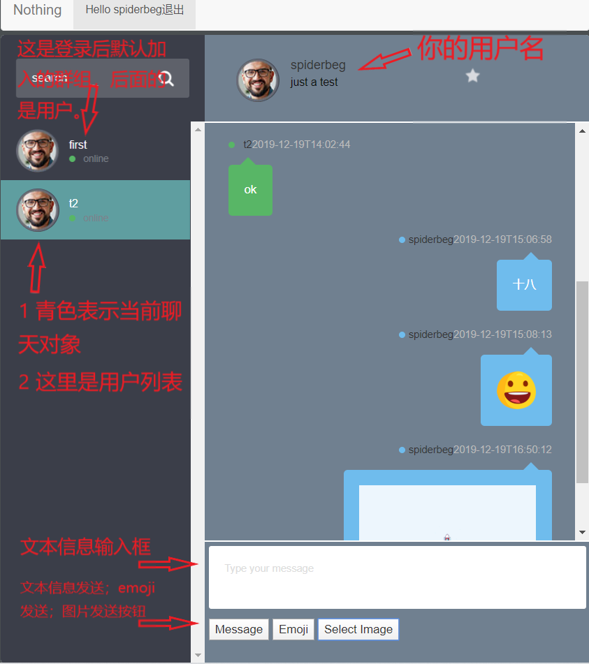
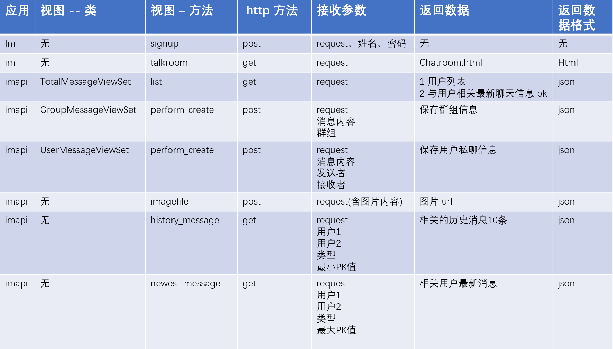

# Python 实现简单即时通讯
* 本项目介绍 **Django** 和 **http** 短连接轮询实现简单的本地局域网即时通讯。
* 更多实用而有趣的分析案例请关注：**Crossin的编程教室**
## 项目思路
### 架构设计
* 理解程序的大体流程
 
### 项目思路
1. 模型考虑：从多好友，多群组角度考虑模型设计（初版为减少难度考虑，只使用一个群组）；在模型考虑时，需要注意的是：用户与群组不是一对多，而是多对多的关系，这里的解决思路是创建用户与群组的关系表，以此将多对多转换为一对多的关系。Django 的多对多关系也是这样做的，但自建关系表可以有更多的灵活性，比如添加用户加入群组的时间信息。
2. 在用户在操作界面时，聊天页面是不会整体刷新的，每次更新的数据大致为新的聊天信息，获取历史消息，用户的登录与登出等部分数据的更新，因此为了保证用户交流时的体验，考虑前端异步请求获取需要更新或需发送到后端的数据。需要大量异步请求更新前端数据以完成用户之间的交互，所以后端 Django 后端就需要一个能够便捷构建 api 的方法。这里构建后端 api 接口使用 Django rest framework。方便便完成数据请求、更新、创建等操作。不必考虑刷新前端的整个页面以及使用设备。
3. 考虑用户聊天的整个流程, 包括获取用户最新消息，获取历史消息，发送聊天信息，上传图片文件四大类，并依据具体操作细分构建后端接口。
4. 在前端用 jquery 控制用户的聊天界面以及请求后端 api 构建即时通讯应用。 
### 问题思路
#### Django 判断在线用户
* 本项目中使用 django **cache**，是直接使用底层缓存的 API。用来记录在线用户，相关设置为缓存失效时间为3秒，记录最大在线人数为20人。详见 SampleIm/middleware.py。不太熟悉的可以看看 Django 官方文档对于底层缓存 API 的介绍与操作<https://docs.djangoproject.com/zh-hans/3.0/topics/cache/#basic-usage>。

            # get_many() 接口，返回一个字典，其中包含你请求的键，这些键真实存在缓存中（并且没过期）
            >>> cache.set('a', 1)
            >>> cache.set('b', 2)
            >>> cache.set('c', 3)
            >>> cache.get_many(['a', 'b', 'c'])
            {'a': 1, 'b': 2, 'c': 3}
#### 消息获取
* 后端构建 total 接口，包含与请求用户相关的最新消息 id。这里使用 total 作为轮询的接口。客户端不断的请求 total 接口获取最新消息，当然请求的时间间隔越短消息反应就越即时，但是同时还应该考虑服务器负载和前端请求对客户端造成的负载，所以请求间隔应该适当，推荐 1s 左右的时间间隔。前端 js 以**固定时间间隔**（本项目设置为 1000 ms）请求 total 接口，并将获取的接口数据与前端最新消息 id 数据对比，若有新消息，则前端携带当前 id 请求新消息接口获取最新消息。**具体的接口消息**见<https://shimo.im/docs/CGpqWJgjhPwhKr6G>。

            $(function(){
                self.setInterval("clock()", 1000);//数据请求间隔，轮询设置 
            });
* 对于图片传送，前端 js 使用 **FormData** 传送图片文件，后端使用 Django **ImageField** 保存图片（这里 Django 是将图片保存在你设置路径的服务器本地保存，数据库仅保存图片路径等基本信息。），并返回图片路径。当返回图片路径后，再将路径，以及消息类型等发送到后端作为信息保存。消息类型是为了方便前端不同类别消息展示，将消息分为图片、文本、视频、emoji。但目前仅支持图片、文本、emoji发送。

        //前端图片文件上传代码
        $.ajax({
            type: "POST",
            url: '/imapi/imagefile/',
            data: data,
            contentType:"multipart/form-data; charset=utf-8", 
            processData: false, // jQuery不要去处理发送的数据
            contentType: false, // jQuery不要去设置Content-Type请求头
            headers:{"X-CSRFToken": csrftoken, "Content-Disposition":'attachment; filename=' + filename,},
            success: function (image_url) {
                console.log('function:post_image -> 返回的图片地址',image_url['image_path']);
                // 发送图片消息
                post_message(url=image_url['image_path'],type='P'); 
                console.log('function: post_image -> 发送图片消息');
                // 清空文件输入
                document.querySelector('#fileinput').value = ''; 
            },
            error: function () {
                alert("There was an error, please try again!");
            }
        })
## 当前功能
### 功能列表
1. 用户登入，默认加入群组且只有**一个群组**
2. 显示所有在线用户且**任意用户**之间可私聊
3. 用户登录后默认显示与之相关的用户或群组之间的最新10条消息
4. 文字、图片信息发送
5. 查看历史消息
6. 消息提醒，暂以每次**登录接收消息**为新消息提醒的基准线
### 操作示例
* 用户聊天
 
* 用户登入、退出
 
* 查看历史消息
 
* 登录及消息提醒
 
* 下面为聊天用户界面，注意搜索功能没有实现。
 
## 模型设计
* 用户模型使用 Django 自带的模型，模型按照多用户多群组设计（目前阶段部分代码按照一个群组，多用户编写；如获取群组消息时，直接获取群组消息模型中的数据，而未根据群组名进行筛选）。

      # 未使用 filter 及群名筛选
      GroupMessage.objects.all()
 
## 接口介绍
* 这里介绍主要的接口，主要是相关**函数**的作用。接口文档<https://shimo.im/docs/CGpqWJgjhPwhKr6G>。
 
## 运行环境
* python 3.7
* windows/linux
## 运行依赖
* Django==3.0.1
* mysqlclient
* djangorestframework==3.10.3
* pillow==6.2.1
## 文件说明
### 以下为详解部分
* 最外层的 SampleIm 文件夹只是包含你的项目文件，这个目录名与 Django 没有关联，可以任意命名。
* manage.py: 管理 Django 项目的命令行工具。 
* 里面一层的 SampleIm 包含你的项目，是一个纯 Python 包。在 manage.py 的同级目录下的应用可以作为顶级模块导入。
* SampleIm/\_\_init\_\_.py: 一个空文件，告诉 Python 这个目录应该被认为是一个 Python 包。
* SampleIm/settings.py: Django 项目的配置文件。可 from django.conf import settings 导入
* SampleIm/urls.py: Django 项目的 URL 声明，以下为举例。
  
      urlpatterns = [
      path('polls/', include('polls.urls')),
      path('admin/', admin.site.urls),
      ]
    * 函数 include() 允许引用其他 URLconfs(如本项目的 im/urls.py). 每当 Django 遇到 include() 时，他会截断与此项匹配的 URL 的部分，并将剩余的字符串发送到 URLconf 以供进一步处理。注意：当包括其他 URL 模式时你应该总是使用 include()。
    * path() 函数中两个必需参数：route 和 view；route 是一个匹配 URL 的准则，当 Django 找到一个匹配的准则，就会调用 view 这个特定的视图函数。并传入 HttpRequest 对象（即 request）作为第一个参数，被捕获的参数以关键字参数的形式传入。
* SampleIm/wsgi.py: 作为你的项目运行在 WSGI（Web 服务器网关接口，一种 Python 标准） 兼容的 Web 服务器上的入口，如 uWSGI（一种 WSGI 实现）。
* SampleIm/middleware.py: 用于记录在线用户的中间件。并设置了记录在线的最大人数为20人。 
* media/: 储存文件，需在 SampleIm/settings.py 中配置 MEDIA_ROOT 和 MEDIA_URL。
    * MEDIA_ROOT：文件储存路径；
    * MEDIA_URL：处理 MEDIA_ROOT 对应的储存文件的 url。
* im 与 imapi 为创建的应用，im：返回聊天页面，并负责用户登录，注册，退出。imapi：与前端信息交流的接口。
* 应用下的 views.py: 视图函数用于处理 web 请求并返回 web 响应。
* 应用下 admin.py: 可将模型注册到后台，方便管理。
* 应用下 models.py: 用于定义模型，也就是数据库结构设计和附加的其他元数据。
* imapi/permissions.py: 限制部分用户拥有写权限。
* im/static/im/js/chatroom.js: 前端 js 代码，包含请求后端接口的所有代码。
* im/templates/im/chatroom2.html, im/static/im/css/chatroom.css: 从网上找的前端界面，地址<http://csshint.com/html-css-chat-box-designs/>,这个页面第12个例子。
## 如何使用
1. 将项目克隆到本地, 选择好放置项目的目录。使用 **git** 运行以下命令：

        git clone https://github.com/spiderbeg/SampleIM.git
2. 本项目使用 mysql 数据库。在本地 mysql 数据库中创建 SampleIm/settings.py 中对应的用户名、密码、数据库，或使用你当前用户名、密码即可，不过需创建与 settings.py 中同名的数据库并**配置 settings.py 中对应设置**。

        # MySQL
        DATABASES = {

            'default': {

                'ENGINE': 'django.db.backends.mysql',

                'NAME': 'sampleim',

                'USER': 'im',

                'PASSWORD': 'password',

                'HOST': 'localhost',

                'PORT': '3306',

                'OPTIONS':{

                'charset':'utf8mb4',

                } } }
3. 激活模型，创建数据库，输入以下命令：

        # 第一步
        python manage.py makemigrations
        # 第二步
        python manage.py migrate
4. 若以上没有问题（为了方便查看后台数据也可先创建超级用户： python manage.py createsuperuser），直接输入以下命令开始运行, 然后在浏览器中输入 <http://127.0.0.1:8000/im>，即可运行：

        python manage.py runserver
## 一些建议及注意事项
### 关于 Django rest framework
* 本项目使用了 **Django rest framework** 来构建 api 与前端通信。这里推荐一个中文翻译网站：<https://q1mi.github.io/Django-REST-framework-documentation/>, 如果想好好学习一下 Django rest framework，建议将**教程**中的示例教程亲手做一次。这会对理解会有很大帮助。当然喜欢看英文的链接在这<https://www.django-rest-framework.org/>。
### 接口文档
* 提醒一下，详细的接口文档<https://shimo.im/docs/CGpqWJgjhPwhKr6G>。
## Crossin的编程教室
* 更多实用而有趣的分析案例请关注：**Crossin的编程教室** 
   

    
        
  
